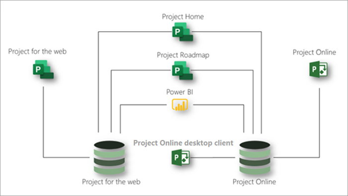

# Descrição do serviço do Microsoft ProjectMicrosoft Project service description

## Visão GeralOverview

O Microsoft Project oferece os seguintes aplicativos para ajudar a atender às necessidades da sua organização para o gerenciamento de projetos e trabalho:Microsoft Project offers the following applications to help meet your organization's needs for project and work management:

- Project para a WebProject for the web
- Project OnlineProject Online 
- Cliente da área de trabalho do Project onlineProject Online desktop client

Este artigo o ajudará a entender quais aplicativos são fornecidos em cada assinatura de projeto e quais recursos cada aplicativo oferece.This article will help you understand which applications are provided in each Project subscription and what capabilities each application offers.

### Project para a WebProject for the web

O Project para a Web é a oferta mais recente da Microsoft para o gerenciamento de projetos e trabalhos em nuvem.Project for the web is Microsoft's most recent offering for cloud-based work and project management. O Project para a Web fornece recursos de gerenciamento de trabalho simples e eficientes para atender à maioria das necessidades e funções.Project for the web provides simple, powerful work management capabilities to meet most needs and roles. Os gerentes de projeto e os membros da equipe podem usar o Project para a Web para planejar e gerenciar o trabalho de qualquer tamanho.Project managers and team members can use Project for the web to plan and manage work of any size.

O Project para a Web é criado na plataforma de alimentação da Microsoft.Project for the web is built on the Microsoft Power Platform. A plataforma de alimentação consiste em PowerApps, automatização de energia, Power BI e o serviço de dados comuns (CDS).The Power Platform consists of PowerApps, Power Automate, Power BI, and the Common Data Service (CDS). O Project para os dados da Web é armazenado em CDS.Project for the web data is stored in CDS. 

O Project para a Web está disponível por meio de três assinaturas: plano de projeto 1, plano de projeto 3 e plano de projeto 5.Project for the web is available through three subscriptions: Project Plan 1, Project Plan 3, and Project Plan 5. Os recursos listados no [projeto para a seção recursos da Web](#project-for-the-web-features) interagem apenas com os dados do projeto para o repositório de dados da Web.Features listed in the [Project for the web features](#project-for-the-web-features) section interact only with data in the Project for the web data store.

### Project OnlineProject Online
 
O Project online é uma solução online flexível para o gerenciamento de portfólio de projetos (PPM) e o trabalho diário.Project Online is a flexible online solution for Project Portfolio Management (PPM) and everyday work. O Project online oferece poderosos recursos de gerenciamento de projetos para planejamento, priorização e gerenciamento de projetos e investimentos &mdash; de portfólio de projetos de praticamente qualquer lugar em praticamente qualquer dispositivo.Project Online provides powerful project management capabilities for planning, prioritizing, and managing projects and project portfolio investments&mdash;from almost anywhere on almost any device. O Project Online pode ser usado por administradores, visualizadores e gerentes de portfólio, gerentes de projeto e de recursos, e líderes e membros de equipe.Project Online can be used by administrators, portfolio managers and viewers, project and resource managers, and team leads and members.

O Project online foi criado na plataforma do SharePoint e armazena dados no repositório de dados do SharePoint.Project Online is built on the SharePoint platform, and it stores data in the SharePoint data store.

O Project online está disponível por meio de duas assinaturas: plano de projeto 3 e plano de projeto 5.Project Online is available through two subscriptions: Project Plan 3 and Project Plan 5. Os recursos listados na seção [recursos do Project online](#project-online-features) interagem apenas com os dados do repositório de dados do SharePoint Online.Features listed in the [Project Online features](#project-online-features) section interact only with data in the Project Online SharePoint data store.

A funcionalidade de membros da equipe para o Project online está disponível por meio de uma assinatura do Project online Essentials.Team member functionality for Project Online is available through a Project Online Essentials subscription. O Project online Essentials é uma assinatura *complementar*   de membros da equipe para clientes que tenham o plano de projeto 3 ou assinaturas do Project Plan.Project Online Essentials is a team member *add-on* subscription for customers who have Project Plan 3 or Project Plan 5 subscriptions. Ele fornece aos membros da equipe uma interface da Web para executar atualizações de tarefas e de tempo para projetos gerenciados no Project online.It gives team members a web interface to perform task and time updates to projects managed in Project Online.

Os membros da equipe com o Project online Essentials podem executar as seguintes funções do Project online:Team members with Project Online Essentials can perform the following Project Online functions:

- Usar uma interface baseada na WebUse a web-based interface
- Atualizar tarefas, problemas e riscosUpdate tasks, issues, and risks
- Enviar quadros de horáriosSubmit timesheets
- Compartilhar documentos e colaborar com o Microsoft Teams ou usuários do Skype for BusinessShare documents and collaborate with Microsoft Teams or Skype for Business users

O Project online Essentials não inclui o Project para a Web.Project Online Essentials does not include Project for the web.

### Cliente da área de trabalho do Project onlineProject Online desktop client

Microsoft Project Online Desktop Client é um programa de gerenciamento de projetos que apresenta programação automatizada, gerenciamento de recursos do projeto e relatórios internos.Microsoft Project Online desktop client is a project management program that features automated scheduling, project resource management, and built-in reporting. O cliente da área de trabalho do Project online pode ser usado como um aplicativo autônomo ou pode se conectar ao Project online.Project Online desktop client can be used as a standalone application or it can connect to Project Online. Project Online Desktop Client é a versão de assinatura do cliente de área de trabalho do Project Professional e está disponível no plano de projeto 3 e nas assinaturas do Project Plan 5.Project Online desktop client is the subscription version of the Project Professional desktop client and is available in Project Plan 3 and Project Plan 5 subscriptions.

### Usando o Project para a Web e o Project online juntosUsing Project for the web and Project Online together

Embora o Project para a Web e o Project online sejam aplicativos separados, você pode usá-los lado a lado.Although Project for the web and Project Online are separate applications, you can use them side-by-side. Você pode ver todos os seus projetos dos dois aplicativos no início do projeto.You can see all your projects from both applications in Project Home. Você pode usar o recurso de mapa do projeto para criar mapas que incluem projetos de ambos os aplicativos.You can use the Project Roadmap capability to build roadmaps that include projects from both applications. E você pode usar o Power BI e o projeto para o pacote de conteúdo do Web Power BI para obter informações sobre projetos e recursos entre os dois aplicativos. 3And you can use Power BI and the Project for the web Power BI content pack to gain insights into projects and resources across the two applications.3

Este diagrama mostra como os aplicativos podem trabalhar juntos lado a lado.This diagram shows how the applications can work together side-by-side.

No futuro, a Microsoft se concentrará no Project para as inovações da Web.Going forward, Microsoft will focus on Project for the web innovations. No entanto, você pode continuar usando o Project online com confiança, pois ele continuará a receber melhorias de desempenho e segurança.However, you can continue using Project Online with confidence as it will continue to receive key performance and security improvements.

## Assinaturas do Microsoft ProjectMicrosoft Project subscriptions

O Microsoft Project está disponível por meio de três assinaturas diferentes para atender às necessidades da sua organização.Microsoft Project is available through three different subscriptions to best meet the needs of your organization. Essas assinaturas são o plano de projeto 1, o plano de projeto 3 e o plano de projeto 5.These subscriptions are Project Plan 1, Project Plan 3, and Project Plan 5. Para comparar recursos entre assinaturas, confira [recursos de disponibilidade entre aplicativos e assinaturas](#feature-availability-across-applications-and-subscriptions).To compare features across subscriptions, see [Feature availability across applications and subscriptions](#feature-availability-across-applications-and-subscriptions).

|ProdutoProduct | Plano 1Plan 1 | Plano 3Plan 3 | Plano 5Plan 5 |
|--------|-----------------------------|------------------------|------------------------|
|Project para a WebProject for the web |**x****x**  | **x x****x x** | **x x****x x** |
|Project OnlineProject Online | |**x x****x x**| **x x x****x x x** |
|Cliente da área de trabalho do Project onlineProject Online desktop client | |**x****x**|**x****x**|

Na tabela acima, o número de cheques (**x**) indica o nível geral de recursos fornecidos por um plano.In the table above, the number of checks (**x**) indicates the general level of capabilities provided by a plan. Por exemplo, para o Project online, o plano 5 fornece mais recursos e, em seguida, plano 3.For example, for Project Online, Plan 5 provides more capabilities then Plan 3.

## Disponibilidade de recursos entre aplicativos e assinaturasFeature availability across applications and subscriptions

### Projeto para recursos da WebProject for the web features

Os recursos listados nesta seção interagem somente com dados no projeto para o repositório de dados da Web.Features listed in this section interact only with data in the Project for the web data store. Todos esses recursos estão disponíveis em todas as assinaturas do Microsoft Project: plano de projeto 1, plano de projeto 3 e plano de projeto 5.All these features are available in all Microsoft Project subscriptions: Project Plan 1, Project Plan 3, and Project Plan 5.

|RecursoFeature | DescriçãoDescription | Licenças do Office 365Office 365 licenses | Plano 1Plan 1 | Plano 3Plan 3 | Plano 5Plan 5|
|--------|-----------------------------|--------------|------------|------------|------------|
|**Gerenciamento de projetos, tarefas e tempo****Project, task, and time management**||||||
|Exibição de quadroBoard view | Acompanhe as tarefas do projeto visualmente para melhorar o fluxo de trabalho e monitoramento de status usando quadros de tarefas personalizados e prontos para uso.Track project tasks visually for improved workflow and status monitoring by using out-of-the-box and custom task boards.| Somente exibiçãoView only | SimYes | SimYes| SimYes|
|DependênciasDependencies | Definir e controlar visualmente as dependências entre tarefas.Set and visually track dependencies between tasks.| Somente exibiçãoView only | SimYes | SimYes| SimYes|
|Exibição de gradeGrid view | Planejar e gerenciar projetos usando uma exibição de grade hierárquica de tarefas.Plan and manage projects by using a hierarchical grid view of tasks. | Somente exibiçãoView only | SimYes | SimYes | SimYes |
|MarcosMilestones | Estabelecer e acompanhar Marcos de tarefas e projetos importantes.Establish and track important project and task milestones.|Somente exibiçãoView only | SimYes | SimYes | SimYes |
|Página inicial do projetoProject Home | Controlar e gerenciar os resultados usando datas de início e término e agendamento automatizado.Track and manage deliverables using start and end dates and automated scheduling.| SimYes | SimYes | SimYes | SimYes |
|Agendamento de tarefasTask scheduling | Obtenha uma visão dos projetos que você trabalhou recentemente, bem como projetos importantes que você precisa monitorar de perto.Get a birds-eye view of projects that you've worked on recently, as well as important projects that you need to monitor closely.| Somente exibiçãoView only | SimYes | SimYes | SimYes |
|Exibição de linha do tempo (gráfico de Gantt)Timeline view (Gantt chart) | Rastreie e entenda visualmente datas, dependências e atribuições de projetos em um modo de exibição de linha do tempo hierárquico.Visually track and understand project dates, dependencies, and assignments in a hierarchical timeline view.|Somente exibiçãoView only | SimYes | SimYes | SimYes |
|Tarefas de resumoSummary tasks | Planejar, gerenciar e acompanhar produtos e fases usando tarefas de resumo.Plan, manage, and track deliverables and phases by using summary tasks.| Somente exibiçãoView only | SimYes | SimYes | SimYes |
|**Colaboração****Collaboration** ||||||
|Integração do Microsoft TeamsMicrosoft Teams integration | Colabore em projetos no Microsoft Teams. 1Collaborate on projects in Microsoft Teams.1 | SimYes | SimYes | SimYes | SimYes |
|**Gerenciamento de recursos e programas****Resource and program management** ||||||
|Configuração da equipe de projetoProject team setup | Gerenciar uma equipe de projeto adicionando e removendo membros e definindo o calendário de trabalho.Manage a project team by adding and removing members and setting the working calendar. | NãoNo | SimYes | SimYes | SimYes |
|RoteirosRoadmaps | Crie mapas visuais e interativos entre projetos do Microsoft Project online, do Microsoft Project para os projetos Web e do Azure Boards. 2   Com o plano de projeto 1, você obtém acesso somente leitura aos mapas.Build visual, interactive roadmaps across projects from Microsoft Project Online, Microsoft Project for the web, and Azure Boards projects.2 With Project Plan 1 you get read-only access to roadmaps. Com o plano de projeto 3 ou o plano de projeto 5, você também pode criar mapas.With Project Plan 3 or Project Plan 5 you can also create roadmaps. | Somente exibiçãoView only | Somente exibiçãoView only | SimYes | SimYes |
|**Relatório**3**Reporting**3 ||||||
|Relatórios prontos para usoOut-of-the-box reporting | Use relatórios pré-criados para entender os dados do projeto, do programa, do portfólio e do recurso.Use pre-built reports to understand project, program, portfolio, and resource data. | NãoNo | SimYes | SimYes | SimYes |
|Relatórios personalizadosCustom reports | Entenda os dados importantes para a sua organização criando relatórios personalizados com base em relatórios prontos para uso ou a partir do zero.Understand the data important to your organization by building custom reports based on out-of-the-box reports or from scratch. | NãoNo | SimYes | SimYes | SimYes |
|Painéis e portaisDashboards and portals | Criar painéis e portais personalizados para ajudar a atender às necessidades específicas da organização.Build custom dashboards and portals to help meet specific organizational needs.| NãoNo | SimYes | SimYes | SimYes |
|**Praticidade****Usability** ||||||
|CoautoriaCoauthoring | Trabalhe em conjunto com participantes e membros da equipe para compilar, editar e atualizar simultaneamente listas de tarefas, cronogramas do projeto e muito mais.Work together with stakeholders and team members to simultaneously build, edit, and update task lists, project schedules, and more.| Somente exibiçãoView only | SimYes | SimYes | SimYes |
|Indicadores gráficosGraphical indicators | Compreenda o status da tarefa, as atribuições e muito mais com indicadores gráficos.Understand task status, assignments, and more with graphical indicators.| Somente exibiçãoView only | SimYes | SimYes | SimYes |
|**Mobilidade****Mobility** ||||||
|Aplicativos móveisMobile applications | Criar aplicativos móveis personalizados com o PowerApps. 4Build custom mobile applications with PowerApps.4 |NãoNo | NãoNo | SimYes | SimYes |
|**Personalização e integração****Customization and integration**||||||
|PowerAppsPowerApps | Construa e consuma soluções para Web e móveis com o PowerApps. 4Build and consume solutions for web and mobile with PowerApps.4 | NãoNo | NãoNo | SimYes | SimYes |
|Fluxos de trabalhoWorkflows | Automatize e integre processos de negócios com automatização de energia. 5Automate and integrate business processes with Power Automate.5 | NãoNo | NãoNo | SimYes | SimYes |
|Integração da MicrosoftMicrosoft integration | Colaborar, gerenciar documentos e muito mais usando ferramentas e aplicativos conhecidos da Microsoft. 1Collaborate, manage documents, and more by using familiar Microsoft tools and applications.1 | SimYes | SimYes | SimYes | SimYes |
|**Gerenciamento de segurança e de usuários****Security and user management**||||||
|Grupos modernos do OfficeOffice Modern Groups | Crie uma equipe de projeto para colaborar com o e configurar facilmente uma coleção de recursos para que os membros da equipe compartilhem.Build a project team to collaborate with and easily set up a collection of resources for team members to share. | SimYes | SimYes | SimYes | SimYes |

### Recursos do Project OnlineProject Online features

Os recursos listados nesta seção interagem apenas com os dados do repositório de dados do SharePoint Online.Features listed in this section interact only with data in the Project Online SharePoint data store.

|RecursoFeature | DescriçãoDescription | Plano de projeto 3Project Plan 3 | Plano de projeto 5Project Plan 5 |
|--------|-------------|-----------------------------|------------------------|
|**Gerenciamento de projetos, tarefas e tempo****Project, task, and time management**||||
|Alertas e lembretesAlerts and reminders | Fique em dia para tarefas futuras importantes e eventos de projeto com lembretes no Outlook e no Microsoft Teams. 1Stay on schedule for important upcoming tasks and project events with reminders in Outlook and Microsoft Teams.1| SimYes | SimYes |
|LinhasBaselines | Defina as linhas de base do projeto para monitorar o desempenho atual em relação ao desempenho passado usando o Project Web App.Set project baselines to monitor current performance against past performance using the Project Web App.| SimYes | SimYes |
|Exibição de quadroBoard view | Rastreie visualmente as tarefas do projeto para melhorar o fluxo de trabalho e monitoramento de status.Visually track project tasks for improved workflow and status monitoring. | SimYes | SimYes |
|Caminho críticoCritical path | Rastreie visualmente as tarefas que representam o caminho mais longo através do projeto usando o Project Web App.Visually track the tasks that represent the longest path through the project using the Project Web App.| SimYes | SimYes |
|Gerenciamento de resultados finaisDeliverable management | Controlar e gerenciar os resultados usando datas de início e término e agendamento automatizado.Track and manage deliverables using start and end dates and automated scheduling.| SimYes | SimYes |
|DependênciasDependencies | Definir e controlar visualmente as dependências entre tarefas.Set and visually track dependencies between tasks.| SimYes | SimYes |
|Modo de exibição GanttGantt view | Rastreie e entenda visualmente datas, dependências e atribuições de projetos em um gráfico de Gantt hierárquico usando o Project Web App.Visually track and understand project dates, dependencies, and assignments on a hierarchical Gantt chart using the Project Web App.| SimYes | SimYes |
|Exibição de gradeGrid view | Planejar e gerenciar projetos usando uma exibição de grade hierárquica de tarefas usando o Project Web App.Plan and manage projects using a hierarchical grid view of tasks using the Project Web App.| SimYes | SimYes |
|Gerenciamento de problemas e riscosIssue and risk management | Identificar e acompanhar problemas e riscos no nível do projeto e da tarefa.Identify and track issues and risks at the project and task level.| SimYes | SimYes |
|Projetos principaisMaster projects | Agrupar projetos relacionados menores em um único projeto mestre usando o Project Web App.Group smaller related projects under a single master project using the Project Web App. | SimYes | SimYes |
|NotificationsNotifications | Fique na parte superior das atribuições de tarefas, status e eventos importantes do projeto com as notificações do Outlook e do Microsoft Teams. 1Stay on top of task assignments, status, and important project events with Outlook and Teams notifications.1 | SimYes | SimYes |
|Página inicial do projetoProject Home | Obtenha uma visão dos projetos que você trabalhou recentemente, bem como projetos importantes que você precisa monitorar de perto.Get a birds-eye view of projects that you've worked on recently, as well as important projects that you need to monitor closely.| SimYes | SimYes |
|Controle de versão do projetoProject versioning | Comparar versões diferentes de um projeto com um relatório que mostra o que foi alterado entre as versões.Compare different versions of a project with a report that shows what changed between versions. | SimYes | SimYes |
|Tarefas de resumoSummary tasks | Planejar, gerenciar e acompanhar produtos e fases usando tarefas de resumo no Project Web App.Plan, manage, and track deliverables and phases using summary tasks in the Project Web App. | SimYes | SimYes |
|Agendamento de tarefasTask scheduling | Use datas de início e de término, esforço, trabalho, tempos de avanço e retardo e dependências para obter um cronograma preciso de datas do projeto usando o Project Web App.Use task start and end dates, effort, work, lead and lag times, and dependencies to get an accurate schedule of project dates using the Project Web App. | SimYes | SimYes |
|Atualizações de tarefasTask updates | Capturar o tempo e o status com comentários sobre tarefas de projeto, trabalho não relacionado ao projeto e período de folga.Capture time and status with comments on project tasks, non-project work, and non-working time. | SimYes | SimYes |
|Linhas do tempoTimelines | Rastreie e entenda visualmente datas, dependências e atribuições de projetos em um modo de exibição de linha do tempo usando o Project Web App.Visually track and understand project dates, dependencies, and assignments on a timeline view using the Project Web App. | SimYes | SimYes |
|Quadros de horáriosTimesheets | Os membros da equipe podem inserir tempo e status em tarefas, trabalho não relacionado ao projeto e período de folga.Team members can enter time and status against tasks, non-project work, and non-working time. | SimYes | SimYes |
|Aprovações de quadro de horáriosTimesheet approvals | Os membros da equipe podem enviar quadros de horários para aprovação.Team members can submit timesheets for approval. Os gerentes de recursos e os supervisores podem revisar, aprovar e recusar quadros de horários enviados.Resource managers and supervisors can review, approve, and decline submitted timesheets. | SimYes | SimYes |
|Configuração de período de folgaNon-working time setup | Adicione férias, feriados, licença médica e qualquer tempo ocioso no cronograma do seu projeto.Add vacation, holidays, medical leave, and other nonworking time into your project schedule. | NãoNo | SimYes |
|**Colaboração****Collaboration** ||||
|AnexosAttachments | Anexar documentos, imagens e outros arquivos na equipe, no projeto ou no nível da tarefa.Attach documents, images, and other files at the team, project, or task level. Gerencie esses anexos em uma biblioteca central no nível da equipe ou do projeto.Manage these attachments in a central library at the team or project level. | SimYes | SimYes |
|Membros externos da equipeExternal team members |Colaborar com pessoas de fora de sua organização, concedendo a elas acesso para exibir e interagir com seus projetos, tarefas e documentos. 6Collaborate with people from outside of your organization by granting them access to view and interact with your projects, tasks, and documents.6 | SimYes | SimYes |
|Sites de projetoProject sites | Criar e personalizar um hub para colaboração e documentos de um projeto.Create and customize a hub for collaboration and documents for a project. | SimYes | SimYes |
Integração do Microsoft TeamsMicrosoft Teams integration | Colabore em projetos no Microsoft Teams. 1Collaborate on projects in Microsoft Teams.1 | SimYes | SimYes |
|**Gerenciamento de demanda****Demand management** ||||
|Configuração do fluxo de trabalho de aprovação de solicitação do projetoProject request approval workflow setup | Crie os fluxos de trabalho que você precisa para avaliar, priorizar e aprovar a demanda de entrada.Build the workflows you need to evaluate, prioritize, and approve incoming demand. | NãoNo | SimYes |
|Criação de formulários de solicitação de projetoProject request forms creation | Capture dados importantes sobre a demanda de entrada para ajudá-lo a avaliar e priorizar o novo trabalho.Capture important data about incoming demand to help you evaluate and prioritize new work. | NãoNo | SimYes |
|Solicitações de projetoProject requests | Rastrear, gerenciar, avaliar e priorizar a demanda de entrada de dentro de sua organização e de clientes e parceiros externos.Track, manage, evaluate, and prioritize incoming demand from within your organization and from external customers and partners. | SimYes | SimYes |
|**Gerenciamento de recursos, programas e portfólios****Resource, program, and portfolio management** ||||
|Custos e orçamento do projetoProject costing and budgeting | Compare o andamento e o orçamento planejados com o tempo e os custos reais usando o Project Web App.Compare planned progress and budget against actual time and costs using the Project Web App. | SimYes | SimYes |
|Configuração da equipe de projetoProject team setup | Gerenciar uma equipe de projeto adicionando e removendo membros, definindo níveis de alocação e adicionando membros externos.Manage a project team by adding and removing members, setting allocation levels, and adding external members. | SimYes | SimYes |
|Modos de exibição de capacidade do recursoResource capacity views | Controlar e gerenciar a capacidade de recursos no nível do projeto, da equipe e da organização.Track and manage resource capacity at the project, team, and organization level. | SimYes | SimYes |
|Custo do recursoResource costing | Controlar e gerenciar os custos de recursos do seu projeto.Track and manage the resource costs of your project. | SimYes | SimYes |
|Compromissos de recurso (reservas)Resource engagements (bookings) | Os gerentes de projeto podem enviar solicitações de recursos por função, habilidades ou nome.Project managers can submit requests for resources by role, skills, or name. Os gerentes de recursos podem revisar as solicitações e atribuir os melhores recursos disponíveis.Resource managers can review requests and assign the best resources available. |Sim7Yes7 | Sim8Yes8 |
|Planejamento da capacidade do recursoResource capacity planning | Controlar e gerenciar a capacidade de recursos no nível do projeto, da equipe e da organização.Track and manage resource capacity at the project, team, and organization level. | NãoNo | SimYes |
|RoteirosRoadmaps | Crie mapas visuais e interativos entre projetos do Microsoft Project online, do Microsoft Project para os projetos Web e do Azure Boards. 2Build visual, interactive roadmaps across projects from Microsoft Project Online, Microsoft Project for the web, and Azure Boards projects.2 | SimYes | SimYes |
|Análise de portfólio e priorizaçãoPortfolio analysis and prioritization | Identifique, selecione e forneça portfólios de projetos que melhor se alinhem com a estratégia de negócios da sua organização e Maximize seu retorno sobre o investimento (ROI).Identify, select, and deliver project portfolios that best align with your organization's business strategy and maximize your return on investment (ROI). | NãoNo | SimYes |
|Painéis/portaisDashboards/portals | Compreenda o status, a priorização e mais sobre o portfólio, programa, projeto, tarefa, equipe e nível de recurso com painéis interativos em tempo real.Understand status, prioritization, and more at the portfolio, program, project, task, team, and resource level with real-time interactive dashboards. | SimYes | SimYes |
|Work, generic, and material resourcesWork, generic, and material resources | Adicione recursos a um projeto, como recursos de trabalho, como pessoas, recursos genéricos como carpinteiros e recursos materiais, como computadores e cimento.Add resources to a project, such as work resources like people, generic resources like carpenters, and materials resources like computers and cement. | SimYes | SimYes |
|**Relatório**3**Reporting**3 ||||
|Relatórios prontos para usoOut-of-box reporting | Use relatórios pré-criados para entender os dados do projeto, do programa, do portfólio e do recurso.Use pre-built reports to understand project, program, portfolio, and resource data. | SimYes | SimYes |
|Relatórios personalizadosCustom reports | Entenda os dados importantes para a sua organização criando relatórios personalizados com base em relatórios prontos para uso ou a partir do zero.Understand the data important to your organization by building custom reports based on out-of-box reports or from scratch. | SimYes | SimYes |
|Painéis e portaisDashboards and portals | Criar painéis e portais personalizados para ajudar a atender às necessidades específicas da organização.Build custom dashboards and portals to help meet specific organizational needs. | SimYes | SimYes |
|**Personalização e integração****Customization and integration**||||
|Identidade visual personalizadaCustom branding | Personalizar a implantação do seu projeto usando sua própria marca, logotipo e cores.Customize your Project deployment using your own brand, logo, and colors. | NãoNo | SimYes |
|Custom fieldsCustom fields | Adicione campos personalizados no nível do projeto, da tarefa e do recurso para rastrear os dados importantes para sua organização e seus projetos.Add custom fields at the project, task, and resource level to track data important to your organization and projects. | SimYes | SimYes |
|FórmulaFormulas | Calcule e Capture dados importantes usando fórmulas entre tarefas e projetos.Calculate and capture important data using formulas across tasks and projects. | SimYes | SimYes |
|PowerAppsPowerApps | Construa e consuma soluções para Web e celular (por meio de OData) com PowerApps. 4Build and consume solutions for web and mobile (through OData) with PowerApps.4 | SimYes | SimYes |
|Fluxos de trabalhoWorkflows | Automatize e integre processos de negócios (por meio de OData) com automatização de energia. 5Automate and integrate business processes (through OData) with Power Automate.5 | SimYes | SimYes |
|Integração com Microsoft 365Microsoft 365 integration | Colaborar, gerenciar documentos e mais usando aplicativos e ferramentas da Microsoft conhecidos. 1Collaborate, manage documents, and more using familiar Microsoft tools and applications.1 | SimYes | SimYes |
|Integração do Microsoft PlannerMicrosoft Planner integration | Conectar tarefas do projeto a um plano do Planner e acompanhar o trabalho detalhado no Planner. 1Connect Project tasks to a Planner plan and track detailed work in Planner.1 | SimYes | SimYes |
|**Gerenciamento de segurança, usuário e serviço****Security, user, and service management**||||
|Integração do Active DirectoryActive Directory integration | Criar equipes a partir de qualquer membro do Active Directory da sua organização. 9Build teams from any member of your organization's Active Directory.9 | SimYes | SimYes |
|Gerenciamento de usuáriosUser management | Gerenciar permissões e funções de usuário e grupo no nível do projeto, da equipe e da organização.Manage user and group roles and permissions at the project, team, and organization level. | NãoNo | SimYes |
|Administração de serviçosService administration | Planejar, instalar e configurar, manter e estender o ambiente do Microsoft Project como parte do seu ambiente do Office 3651 .Plan, install and configure, maintain, and extend your Microsoft Project environment as part of your Office 3651 environment.  | NãoNo | SimYes |

#### ObservaçõesNotes

1 requer uma assinatura comercial do Office ou do Microsoft 365.1 Requires an Office or Microsoft 365 commercial subscription. 
2 placas Azure adquiridas separadamente.2 Azure Boards acquired separately. 
3 os relatórios do Project para a Web e o Project online estão disponíveis usando o Power bi.3 Reporting for Project for the web and Project Online is available by using Power BI. A exibição, edição e criação de relatórios requer uma assinatura do Power BI.Viewing, editing, and creating reports requires a Power BI subscription. A Microsoft fornece um conjunto predefinido de relatórios do Power BI.Microsoft provides a pre-built set of Power BI reports. Os usuários podem personalizar esses relatórios ou criar relatórios adicionais usando o Power BI.Users can customize these reports or build additional reports using Power BI.  
4 criar e usar aplicativos móveis personalizados do powerapps que acessam o Project para dados da Web requer uma assinatura do PowerApps e uma assinatura do plano de projeto 3 ou do Project Plan 5. 
4 Building and using custom PowerApps mobile applications that access Project for the web data requires a PowerApps subscription and a Project Plan 3 or Project Plan 5 subscription. 
5 a automação e integração dos processos de negócios com a automatização de energia com o Project para os dados da Web requer uma assinatura automatizada de energia e uma assinatura do plano de projeto 3 ou do Project Plan 5.5 Automating and integrating business processes with Power Automate with Project for the web data requires a Power Automate subscription and a Project Plan 3 or Project Plan 5 subscription. 
6 o licenciamento do Project online para usuários externos segue a mesma política que para usuários internos.6 Project Online licensing for external users follows the same policy as that for internal users. Qualquer interação em um site do Project online requer uma assinatura do plano de projeto 3 ou do Project Plan 5.Any interaction on a Project Online site requires a Project Plan 3 or Project Plan 5 subscription. 
7 os usuários com um plano de projeto 3 ou uma assinatura do Project Plan 5 podem enviar solicitações de compromisso de recurso.7 Users with a Project Plan 3 or Project Plan 5 subscription can submit resource engagement requests. Eles não podem revisar, cumprir ou aprovar solicitações de contrato de recurso.They cannot review, fulfill, or approve resource engagement requests. 
8 usuários com uma assinatura do plano de projeto 5 podem revisar, cumprir e aprovar solicitações de contrato de recurso.8 Users with a Project Plan 5 subscription can review, fulfill, and approve resource engagement requests. 
9 o Active Directory requer uma assinatura separada.9 Active Directory requires a separate subscription.  

### Recursos do cliente de área de trabalho do Project onlineProject Online desktop client features

|RecursoFeature | DescriçãoDescription |
|--------|-------------|
|**Gerenciamento de projetos e tarefas****Project and task management**||
|LinhasBaselines | Defina as linhas de base do projeto para monitorar o desempenho atual em relação ao desempenho passado.Set project baselines to monitor current performance against past performance. |
|Modo de exibição de calendárioCalendar view | Controlar prazos e Marcos de tarefas e projetos importantes em um modo de exibição de calendário semanal ou mensal.Track important project and task deadlines and milestones on a weekly or monthly calendar view. |
|Caminho críticoCritical path | Rastreie visualmente as tarefas que representam o caminho mais longo no projeto.Visually track the tasks that represent the longest path through the project. |
|PrazosDeadlines | Estabelecer e acompanhar prazos importantes de projetos e tarefas.Establish and track important project and task deadlines. |
|DependênciasDependencies | Definir e controlar visualmente as dependências entre tarefas.Set and visually track dependencies between tasks. |
|Modo de exibição GanttGantt view | Rastreie e entenda visualmente datas, dependências e atribuições de projetos em um modo de exibição de Gantt hierárquico.Visually track and understand project dates, dependencies, and assignments in a hierarchical Gantt view. |
|Exibição de gradeGrid view | Planejar e gerenciar projetos usando uma exibição de grade hierárquica de tarefas.Plan and manage projects using a hierarchical grid view of tasks. |
|Projetos principaisMaster projects | Agrupar projetos relacionados menores em um único projeto mestre.Group smaller related projects under a single master project. |
|MarcosMilestones | Estabelecer e acompanhar Marcos de tarefas e projetos importantes.Establish and track important project and task milestones. |
|Diagrama de redeNetwork diagram | Exibir tarefas, dependências e o caminho crítico do seu projeto em um modo de exibição diagrama de rede.View tasks, dependencies, and the critical path of your project in a network diagram view. |
|Agendamento de tarefasTask scheduling | Usar datas de início e de término, esforço, trabalho, tempos de avanço e retardo e dependências para obter um cronograma preciso das datas do projetoUse task start and end dates, effort, work, lead and lag times, and dependencies to get an accurate schedule of project dates |
|Planejador de equipeTeam planner | Acompanhar a alocação e a capacidade de todos os membros da equipe do projeto, incluindo o trabalho não relacionado ao projeto e o período de folga.Track the allocation and capacity of all project team members, including non-project work and non-working time.|
|Linhas do tempoTimelines | Rastreie e entenda visualmente datas, dependências e atribuições de projetos em um modo de exibição de linha do tempo.Visually track and understand project dates, dependencies, and assignments in a timeline view. |
|Tarefas inativasInactive tasks | Use tarefas inativas para controlar o trabalho sem afetar a disponibilidade ou alocação do recurso e sem afetar o cronograma do projeto.Use inactive tasks to track work without affecting resource availability or allocation and without affecting the project schedule. |
|Tarefas de resumoSummary tasks | Planejar, gerenciar e acompanhar produtos e fases usando tarefas de resumo.Plan, manage, and track deliverables and phases using summary tasks. |
|Inspetor de tarefasTask inspector | Exiba os fatores que afetam o cronograma de uma tarefa, como uma data de início alterada ou mensagens de erro.View factors that affect the scheduling of a task, such as a changed start date or error messages. |
|Análise do caminho da tarefaTask path analysis | Veja como uma tarefa se conecta a outras tarefas realçando seu caminho de tarefa em todo o projeto.See how one task connects to other tasks by highlighting its task path throughout the project. |
|**Gerenciamento de recursos e financeiros****Resource and financial management**||
|Resource levelingResource leveling | Resolver conflitos de recursos ou superalocações ao redistribuir automaticamente as atribuições.Resolve resource conflicts or overallocations by automatically leveling the assignments. |
|Work, generic, and material resourcesWork, generic, and material resources | Adicione recursos a um projeto, como recursos de trabalho, como pessoas, recursos genéricos como carpinteiros e recursos materiais, como computadores e cimento.Add resources to a project, such as work resources like people, generic resources like carpenters, and materials resources like computers and cement. |
|Custos e orçamento do projetoProject costing and budgeting | Compare o andamento planejado e o orçamento com o tempo e os custos reais.Compare planned progress and budget to actual time and costs. |
|Custo do recursoResource costing | Controlar e gerenciar os custos de recursos do seu projeto.Track and manage the resource costs of your project.|
|**Relatórios****Reporting** ||
|Relatórios personalizadosCustom reports | Criar relatórios personalizados para projetos, programas, portfólios e recursos.Build custom reports for projects, programs, portfolios, and resources. |
|Relatórios prontos para usoOut-of-box reporting | Use relatórios pré-criados para entender os dados do projeto, do programa, do portfólio e do recurso.Use pre-built reports to understand project, program, portfolio, and resource data. |
|PDF and XPS outputPDF and XPS output | Salvar um arquivo de projeto como um arquivo PDF ou XPS.Save a Project file as a PDF or XPS file. |
|**Praticidade****Usability**||
|Preenchimento automáticoAuto-complete | Obtenha sugestões de nomes e dependências de tarefas ou recursos conforme você digita.Get suggestions for task or resource names and dependencies as you type. |
|Exibições filtradasFiltered views | Filtrar planos de projeto por qualquer valor no planoFilter project plans by any value in the plan |
|Indicadores gráficosGraphical indicators | Compreenda o status da tarefa, as atribuições e muito mais com indicadores gráficos.Understand task status, assignments, and more with graphical indicators. |
|Desfazer de vários níveisMulti-level undo | Desfaça várias alterações ao mesmo tempo usando o menu **desfazer** .Undo multiple changes at the same time by using the **Undo** menu. |
|Classificação e agrupamentoSorting and grouping | Use classificação e agrupamento personalizados para obter uma visão focalizada do seu projeto, tarefas e recursos.Use custom sorting and grouping to get a focused view of your project, tasks, and resources.|
|**Personalização e integração****Customization and integration**||
|Campos personalizadosCustom fields | Adicione campos personalizados no nível do projeto, da tarefa e do recurso para rastrear os dados importantes para sua organização e seus projetos.Add custom fields at the project, task, and resource level to track data important to your organization and projects. |
|FormuláriosForms | Crie e implante formulários personalizados para capturar dados importantes do projeto.Create and deploy custom forms to capture important project data. |
|FórmulaFormulas | Calcule e Capture dados importantes usando fórmulas entre tarefas e projetos.Calculate and capture important data using formulas across tasks and projects. |
|ModelosTemplates | Criar modelos para projetos comuns, incluindo planos de projeto, equipes e atribuições.Create templates for common projects including project plans, teams, and assignments. |
|importação/exportação. mpp.mpp import/export | Criar novos projetos a partir de arquivos. mpp existentes ou criar um arquivo. mpp de um projeto existente.Create new projects from existing .mpp files or create an .mpp file of an existing project. |
|Importação/exportação do ExcelExcel import/export | Crie novos projetos de arquivos do Excel ou crie um arquivo do Excel de um projeto existente.Create new projects from Excel files or create an Excel file of an existing project. |

## Considerações de serviçoService considerations

> [!NOTE]
> O Project para Web não está disponível no momento para GCC, GCC High e DoD.Project for the web is currently unavailable for GCC, GCC High, and DoD. Estamos trabalhando para entregar o projeto para a Web, mas não é possível compartilhar um período de tempo no momento.We're working on delivering Project for the web to you but are unable to share a firm timeframe at this time.

### Considerações sobre licenciamentoLicensing considerations

- Qualquer interação em um site do Project online requer uma assinatura do plano de projeto 3 ou do Project Plan 5.Any interaction on a Project Online site requires a Project Plan 3 or Project Plan 5 subscription.
- Quando sua última assinatura do plano de projeto 1, plano de projeto 3 ou Project Plan 5 expirar, seu projeto para as instâncias da Web será excluído após 120 dias.When your last Project Plan 1, Project Plan 3, or Project Plan 5 subscription expires, your Project for the web instances will be deleted after 120 days.
- Quando a assinatura do plano de projeto 3 ou do Project plano 5 expirar, as instâncias do Project online serão excluídas após 120 dias.When your last Project Plan 3 or Project Plan 5 subscription expires, your Project Online instances will be deleted after 120 days.
- Para o Project para as assinaturas de avaliação da Web e do Project online, suas instâncias de avaliação serão excluídas 30 dias após o término do período de avaliação.For Project for the web and Project Online trial subscriptions, your trial instances will be deleted 30 days after your trial period ends.

### Usar o SharePoint OnlineUse of SharePoint Online

O Project online requer o uso do SharePoint Online, que é provisionado como parte do Project online.Project Online requires the use of SharePoint Online, which is provisioned as part of Project Online. Os direitos para a funcionalidade do SharePoint Online fornecido com o Project Plan 3 ou o Project Plan 5 subscriptions limitam-se a armazenar e acessar dados para oferecer suporte ao Project online.Rights to the SharePoint Online functionality provided with Project Plan 3 or Project Plan 5 subscriptions are limited to storing and accessing data to support Project Online.

### Roteiro do projeto e automatização de energiaProject Roadmap and Power Automate

O mapa do projeto requer o uso de energia automatizada, que é provisionado como parte da sua assinatura de projeto.Project Roadmap requires the use of Power Automate, which is provisioned as part of your Project subscription. Os direitos de energia automatizar a funcionalidade são limitados aos recursos de automatização de energia necessários para o roteiro do projeto.Rights to Power Automate functionality are limited to those Power Automate capabilities required by Project Roadmap. A funcionalidade automatizada de energia necessária para o mapa de projeto aparece como o plano de **integração de dados do Project com fluxo** de serviço na seção **aplicativos** do centro de administração do Microsoft 365.Power Automate functionality required by Project Roadmap appears as the **Data Integration for Project with Flow** service plan in the **Apps** section of the Microsoft 365 admin center.

### Projeto para o serviço da Web e de dados comunsProject for the web and Common Data Service

O Project para a Web requer o uso do serviço de dados comuns (CDS) para armazenar seus dados.Project for the web requires the use of the Common Data Service (CDS) for storing its data. Os CDS são provisionados como parte da sua assinatura de projeto.CDS is provisioned as part of your Project subscription. Os direitos à funcionalidade de CDS estão limitados a armazenar e acessar dados para dar suporte ao Project para a Web.Rights to CDS functionality are limited to storing and accessing data to support Project for the web. A funcionalidade de CDS necessária para o Project aparece como o **serviço de dados comuns para** o plano de serviço do Project na seção **aplicativos** do centro de administração do Microsoft 365.CDS functionality required by Project appears as the **Common Data Service for Project** service plan in the **Apps** section of the Microsoft 365 admin center.

### Backup e retenção de dadosData backup and retention

O Project para a Web e o Project online têm a mesma política de retenção e backup de dados que o Office 365.Project for the web and Project Online both have the same data backup and retention policy as Office 365. Para obter detalhes, consulte [retenção de dados, exclusão e destruição no Office 365](https://docs.microsoft.com/office365/Enterprise/office-365-data-retention-deletion-and-destruction-overview).For details, see [Data Retention, Deletion, and Destruction in Office 365](https://docs.microsoft.com/office365/Enterprise/office-365-data-retention-deletion-and-destruction-overview).

### Projeto para limites e limitações da WebProject for the web boundaries and limitations

O Project para a Web tem algumas limitações, que são descritas na tabela a seguir.Project for the web has some limitations, which are described in the following table.

|Entidade/campoEntity/field | LimiteLimit |
|-------------|-------|
|**Tarefa****Task** ||
|Máx.Max. nível de hierarquia para a tarefahierarchy level for task | 10 níveis10 levels |
|Máx.Max. links (sucessora + predecessor) de uma tarefalinks (successor + predecessor) for a task | 50820 |
|Máx.Max. duração da tarefa de folhaduration of leaf task | 1250 dias1250 days |
|Máx.Max. duração da tarefa de resumoduration of summary task | 3650 dias (10 anos)3650 days (10 years) |
|Máx.Max. recursos que podem ser atribuídos a uma tarefaresources that can be assigned to a task | 20 recursos20 resources |
|Intervalo de datas com suporte para a tarefaSupported date range for task | 1/1/1984 &ndash; 12/31/21491/1/1984 &ndash; 12/31/2149 |
|**Projeto****Project** ||
|Máx.Max. total de tarefas do projetototal tasks for the project | 500500 |
|Máx.Max. duração total do projetototal duration of the project | 3650 dias (10 anos)3650 days (10 years) |
|Máx.Max. total de recursos para o projetototal resources for the project | 150150 |
|Máx.Max. total de links (somente sucessor) para o projetototal links (successor only) for the project | 600600 |

### Limites e limitações do Project onlineProject Online boundaries and limitations

O Project online tem algumas limitações.Project Online has some limitations. Para obter detalhes, consulte [Project online: limites de software e limites](https://support.office.com/article/5A09DBCE-1E68-4A7B-B099-D5F1B21BA489).For details, see [Project Online: software boundaries and limits](https://support.office.com/article/5A09DBCE-1E68-4A7B-B099-D5F1B21BA489).
